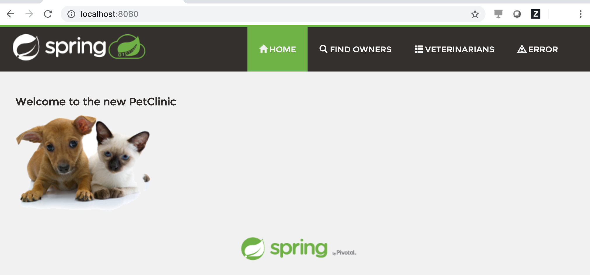

# Appsody Stack Spring PetClinic

Copy of the [Spring PetClinic](https://github.com/spring-projects/spring-petclinic) application added to the spring-boot2 [Appsody](https://appsody.dev) stack.

## Getting started

To run this application using the Appsody CLI:

1. Install Docker for your platform if it is not already installed
1. Make a copy of this repository:  `git clone https://github.com/timroster/app-spring.git`
1. [Install Appsody](https://appsody.dev/docs/getting-started/installation)
1. Change to the repo folder and start the application

    ```bash
    cd app-spring
    appsody run
    ```

1. The application will start up at `http://localhost:8080` for testing and development. (you were using a terminal in your IDE right?) This stack includes the [Spring Developer Tools](https://docs.spring.io/spring-boot/docs/current/reference/html/using-boot-devtools.html#using-boot-devtools) module to support automatic restarts and live reloading during development.

## Using mysql database as a local containerized dependency

This sample Spring Application can be configured to use a mysql database instead of the local HSQL database. When appsody starts the application, it is running under docker in a container, so adding mysql as a dependency is simply a matter of having an additional container with mysql available.

If you already are running the application with `appsody run`, either issue `appsody stop` in a separate terminal or `Ctrl-C` to stop the application.

Use these steps to configure a docker network, start up the mysql container, and then start the application:

1. Create a docker network for the containers to use

    ```bash
    docker network create pets
    ```

1. Launch the mysql container using the network and configure credentials using environment variables

    ```bash
    docker run --env-file mysql.env --network pets --name db mysql:5.7
    ```

1. Start the application with appsody, this time connecting to mysql

    ```bash
    appsody run --docker-options "--env-file mysql.env" --network pets
    ```

## Dynamic updates

With either way of running the application, you can make changes to the code and see them reflected in the running container. To try this out open up the project (if not already) in your favorite IDE (vim counts!) and make a change to the `src/main/resources/messages/messages.properties` file. For example, change the `welcome=Welcome` message to `welcome=Welcome to the new PetClinic`. When you save this file, the Spring Developer tools will update and restart the application. You'll see messages in the `appsody run` terminal when this happens.

Reload the application - if you've updated the messages file as suggested, you should now see:


